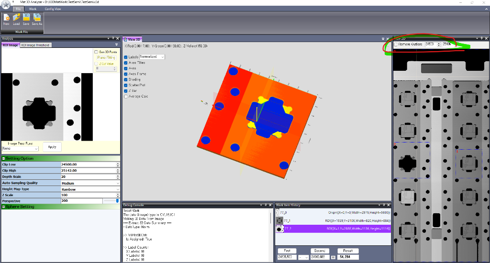

# 3편: 현장 맞춤 기능과 실전 트러블슈팅

> *"소프트웨어의 80%는 기능 개발이지만, 나머지 20%의 현장 디테일이 진짜 생명력을 만든다."*

## 1. 이상치(Outlier) 제거 필터와 [Refresh] 버튼
산업용 X-Ray 및 계측 영상에서는 픽셀 결함, 이물, 먼지 등으로 인해 비정상적으로 튀는 **스파이크 노이즈(Spike Noise)**가 흔히 발생합니다. 이 노이즈 하나 때문에 3D 메쉬 전체의 스케일이 왜곡되어 버립니다.



### 8방향 이웃 평균 보간 (`RemoveOutliersAndFill`)
설정한 Low / High Threshold 범위를 벗어난 이상치 픽셀을 검출하여, 주변 정상 이웃 픽셀들의 평균값으로 부드럽게 매꿔주는 병렬 연산(`Parallel.For`) 루틴을 구현했습니다.

### UI 연동의 디테일: [Refresh] 버튼
초기에는 체크박스만 두었으나, 실제 작업 시에는 **"수치를 조금씩 변경해 보면서 최적의 필터 강도를 실시간으로 확인하고 싶다"**는 요구가 있었습니다.
- 수치 입력란 바로 옆에 **[Refresh] 버튼**을 배치하여, 버튼 클릭 즉시 현재 선택된 ROI의 3D 메쉬와 단차를 비동기(`Task.Run`)로 재계산하도록 개선했습니다.

---

## 2. 작업자를 위한 실시간 단차 사칙연산기
현장 작업자는 단일 부품의 높이뿐만 아니라, **"기준면(First) 대비 부품(Second)의 단차가 몇 마이크로미터인가?"**를 가장 많이 확인합니다.

```
[ First: 24635.500 ]  ─  [ Second: 24540.885 ]  =  [ Result: 54.284 ]
```

* **원클릭 값 추출**: 버튼을 누르면 현재 선택된 ROI의 평균 높이(Mean Value)를 자동으로 텍스트박스에 채웁니다.
* **실시간 자동 연산**: 입력란의 수치나 연산자(`-`, `+`, `*`, `/`)가 변경될 때마다 결과창에 소수점 3자리까지 즉시 갱신됩니다.
* **패널 높이 고정**: 창 전체 크기를 조절하더라도 하단 계산기 영역은 60px 높이로 견고하게 고정되어 작업 동선이 흔들리지 않도록 처리했습니다.

---

## 3. 실전 트러블슈팅: `PlaneList` 인덱스 초과 크래시 해결
과거 저장된 작업 파일(`.x3d`)을 로드하는 도중, `PlaneFitting` 연산에서 예기치 않은 예외(`ArgumentOutOfRangeException`)가 발생하여 프로그램이 종료되는 문제가 있었습니다.

### 원인 분석
과거 파일 포맷이나 불완전하게 저장된 XML의 경우, `<CalcList>`에는 `PlaneFitting`이 들어있지만 **`<PlaneList />` 태그는 0개 점으로 비어 있는 상태**였습니다.
코드에서 리스트 크기를 검증하지 않고 무조건 인덱스 `[0], [1], [2]`에 접근하려다 발생한 문제였습니다.

### 해결: 방어적 프로그래밍 (Defensive Coding)
```csharp
// 수정 전: 점 개수 확인 없이 직접 인덱스 접근 -> Crash 위험!
XGlobal.FitPlaneFromThreePoints(workItem.PlaneList[0].X, ...);

// 수정 후: 3개 이상의 점이 존재하는지 철저한 사전 검증
if (workItem.PlaneList != null && workItem.PlaneList.Count >= 3)
{
    XGlobal.FitPlaneFromThreePoints(
        workItem.PlaneList[0].X, workItem.PlaneList[0].Y, workItem.PlaneList[0].Z,
        workItem.PlaneList[1].X, workItem.PlaneList[1].Y, workItem.PlaneList[1].Z,
        workItem.PlaneList[2].X, workItem.PlaneList[2].Y, workItem.PlaneList[2].Z,
        out double dA, out double dB, out double dC, out double dD);
    ...
}
else
{
    Console.WriteLine("PlaneFitting skipped: PlaneList does not contain at least 3 points.");
}
```
이러한 방어 코드를 통해, 비정상적이거나 구버전 파일이 들어오더라도 프로그램이 죽지 않고 안전하게 처리되도록 개선되었습니다.

---

## 4. 작업 이력(Work Item) 개별 삭제 기능
여러 ROI를 비교하다 보면 잘못 생성된 ROI를 삭제해야 하는 순간이 반드시 옵니다.
- **`Delete` 키 및 마우스 우클릭 컨텍스트 메뉴**를 통해 선택한 항목을 삭제할 수 있도록 구현했습니다.
- 원본 데이터인 `Origin` 항목은 삭제되지 않도록 보호하고, 삭제 시 2D 화면에 오버레이로 그려진 ROI 박스도 즉시 화면에서 제거하여 시각적 일관성을 완성했습니다.
