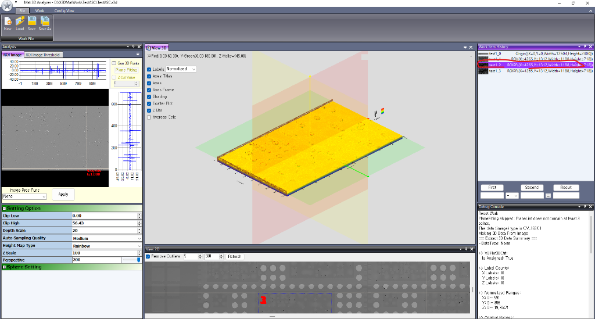

# XMat3D Analyzer

> **2D X-Ray 및 고해상도 단면 영상 기반의 실시간 3D 높이 계측 및 표면 분석 시스템**

  
  

## 🎬 동작 시연 영상 (Demo Video)

  <video width="100%" controls preload="metadata" style="max-height: 480px; border-radius: 8px; box-shadow: 0 4px 16px rgba(0,0,0,0.15);">
    <source src="https://choidaeyong1231.github.io/XMat3D-blog/videos/XMat3D_demo.mp4" type="video/mp4">
    <source src="videos/XMat3D_demo.mp4" type="video/mp4">
    브라우저가 HTML5 비디오 재생을 지원하지 않습니다.
  </video>
  
<em>▲ XMat3D Analyzer 실시간 3D 메쉬 생성, ROI 분석 및 단차 계측 시연 (3분 44초)</em>

  
<small><a href="https://choidaeyong1231.github.io/XMat3D-blog/videos/XMat3D_demo.mp4" target="_blank">🔗 새 창에서 원본 영상 직접 재생하기</a></small>

## 📌 프로젝트 소개
**XMat3D Analyzer**는 반도체, 전자 패키징, 배터리 및 정밀 부품 검사 현장에서 사용되는 산업용 분석 도구입니다.

기존의 고가 3D CT 장비나 무거운 상용 소프트웨어를 도입하지 않고도, **2D 계측 영상(16-bit Grayscale TIFF 등)에서 관심 영역(ROI)을 지정하는 즉시 실시간 3D 표면 메쉬를 생성하여 정밀 단차, 평면 기울기(Tilt), 노이즈를 직관적으로 분석**할 수 있도록 개발되었습니다.

---

## ✨ 핵심 기능

| 기능 | 설명 |
| :--- | :--- |
| **실시간 3D 메쉬 렌더링** | 2D ROI 선택 영역을 OpenTK(OpenGL VBO)를 활용해 60fps로 고속 3D 시각화 |
| **3점 기반 평면 피팅** | 3개의 기준점을 기반으로 평면 방정식($Ax + By + Cz + D = 0$)을 산출해 표면 기울기 보정 |
| **이상치(Outlier) 제거 필터** | 지정한 Low/High 임계값 외의 스파이크 노이즈를 8방향 이웃 평균값으로 실시간 보간(Fill) |
| **실시간 단차 사칙연산** | 다중 ROI 간의 평균 높이를 가져와 덧셈, 뺄셈(단차 비교), 곱셈, 나눗셈 즉시 계산 |
| **데이터 익스포트** | ROI 표시 데이터 TIF, 3D 뷰 캡처 TIF, 3D 높이맵(Heightmap) RAW TIF 3종 내보내기 지원 |
| **작업 이력 관리** | 생성된 ROI 및 분석 조건들을 작업 단위(`.x3d`)로 저장/복원 및 이력 관리 |

---

## 🛠️ 기술 스택
* **언어 및 프레임워크**: C# 7.3, .NET Framework 4.7.2, Windows Forms
* **영상 처리 (Vision)**: OpenCvSharp 3.x
* **3D 그래픽스**: OpenTK (OpenGL Vertex Buffer Object / Shader 기반 고속 렌더링)
* **UI 프레임워크**: Krypton Toolkit (Visual Studio 스타일 다중 도킹 패널 지원)

---

## 📖 실전 개발기 시리즈
이 소프트웨어를 바닥부터 구축하면서 겪은 아키텍처 고민, 그래픽스 최적화, 현장 트러블슈팅을 정리한 엔지니어링 개발 일지입니다.

1. **[1편: 2D 영상으로 3D 검사기를 만든 이유](01-why-we-build.md)**
   - 현장에서 2D만으로 단차를 알 수 없었던 문제의식과 설계 방향
2. **[2편: OpenTK 고속 메쉬 렌더링과 단차 분석](02-opentk-mesh-rendering.md)**
   - 16비트 TIFF 데이터를 3D 정점 버퍼로 변환하고 평면 피팅하는 방법
3. **[3편: 현장 맞춤 기능과 실전 트러블슈팅](03-features-and-troubleshooting.md)**
   - 실제 사용하면서 채워지는 마지막 20%의 디테일(이상치 필터, 크래시 방어)

---

## 📬 Contact & Q&A

프로젝트 협업, 3D 단차 계측 알고리즘 도입, 기술 자문이나 질문이 있으시면 **GitHub Issues**를 통해 편하게 남겨주세요:

👉 **[📝 GitHub Issues에 문의 및 질문 남기기](https://github.com/choidaeyong1231/XMat3D-blog/issues/new)**  
*(개인정보 보호 및 스팸 방지를 위해 GitHub Issues로 안전하게 소통합니다)*
